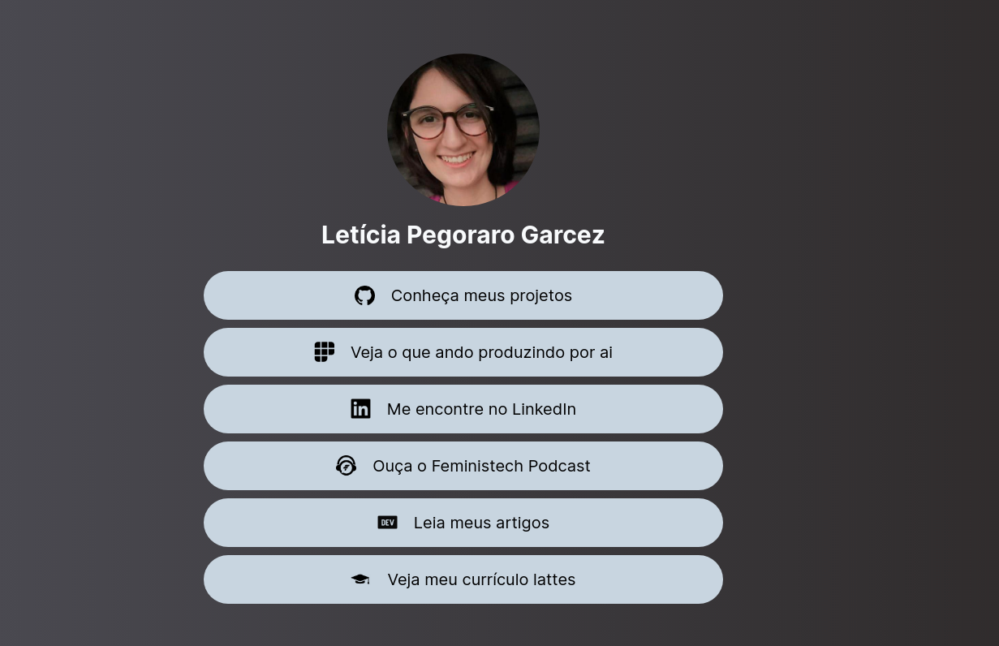

## Site de links pessoais
<p align = "center">  </p>

<p align = "center"> <a href="https://lelepg.herokuapp.com/">Clique aqui para acessar a versão online </a></p>

## O que é este projeto?
Este projeto é um site de links pessoal inspirado pelo projeto desenvolvido pela [Levxyca](https://github.com/levxyca/links). Neste projeto, estou reunindo todos os links que acho relevantes sobre minha vida na internet e também aproveitando pra aplicar alguns conceitos que estou estudando ultimamente.

## Como este projeto foi estruturado?
No arquivo index.php se encontra o código responsável pela interface visual do site. Neste arquivo, é importado o TailwindCSS através de um CDN e o PHP é utilizado para criar uma classe com todas as informações necessárias para cada link da lista de itens e também para renderizá-la através de um foreach. Inicialmente, a abordagem que eu estava pensando em utilizar para gerar a lista dinâmicamente era uma instância Vue, mas neste caso o PHP conseguiu resolver o problema de uma maneira muito mais rápida.

Na pasta imagens, estão disponíveis todas as imagens utilizadas no projeto. A minha imagem de perfil e a imagem mostrada neste README se encontram diretamente na pasta imagens e os logos utilizados nos links se encontram na pasta logos, geralmente em uma resolução de 40X40 que foi a resolução recomendada pela auditoria que fiz no site tendo dispositivos mobile em mente.

## Quais tecnologias foram utilizadas neste projeto?
* PHP -> O motivo principal para utilizar esta linguagem, é que no momento de desenvolvimento deste projeto, eu estou estudando PHP, e queria poder gerar uma estrutura de lista através de um for.
* Tailwind CSS -> Um framework CSS que basicamente já possui a implementação de diversas classes CSS, assim ao invés de implementar as classes na mão, é possível só adicionar as classes que já existem no framework para obter o resultado desejado.
* Lighthouse -> Inspetor de sites do devtools, utilizado para melhorar a acessibilidade, boas práticas e performance do site.
* Heroku -> Foi o site onde eu encontrei o deploy mais simples de um arquivo .php

## Como rodar este projeto?
Você pode rodar o projeto fazendo o download do repsoitório e então usando o comando ```php -S localhost:8080``` (obs: 8080 pode ser substituido por qualquer porta disponível na máquina). Esse comando vai iniciar um servidor de desenvolvimento na porta 8080 a partir do qual você pode acessar o projeto. Alternativamente, você também pode acessar a versão online [clicando aqui](https://lelepg.herokuapp.com/).

## Quer copiar este projeto?
Primeiro de tudo, sinta-se a vontade para fazer o fork do projeto a qualquer hora e utilizá-lo com os seus próprios links pessoais. As alterações que você precisará fazer, são as seguintes:
* Trocar o arquivo perfil.jpeg da pasta imagens por uma imagem sua (tamanho recomendado: 300x300);
* Adicionar novos ícones na pasta imagens/logos caso isso seja necessário (tamanho recomendado: 40X40);
* Alterar o array listaDeLinks definido no arquivo index.php para atualizá-lo com os seus links, frase que você quer que esteja associada ao ícone, nome do ícone, descrição do ícone (será utilizada no atributo alt das imagens) e por sim o link da sua rede social. Caso você não queria utilizar algum dos links que eu utilizei, basta apagar essa entrada no array.
* Troque as cores. No momento, o gradiente de fundo está sendo representado pelas classes ```bg-gradient-to-r from-zinc-600 to-stone-800``` na tag body, e a cor de fundo dos links pelas classes ```bg-slate-300 hover:bg-slate-100``` definidas no li que está dentro do foreach no segundo bloco PHP. 

## Links úteis 
* [Documentação TailwindCSS](https://tailwindcss.com/docs/installation)
